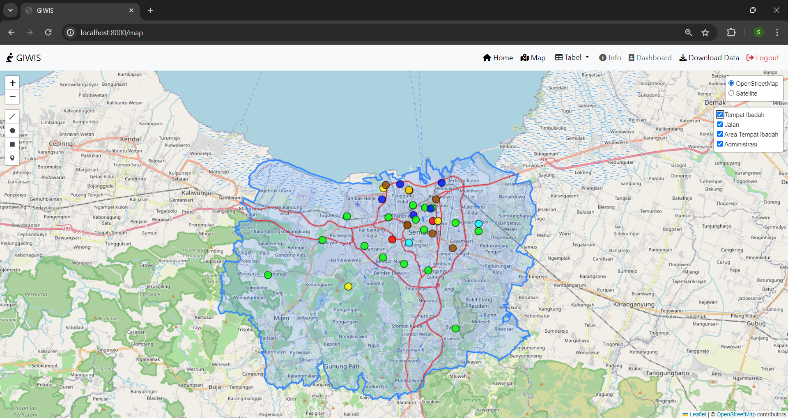
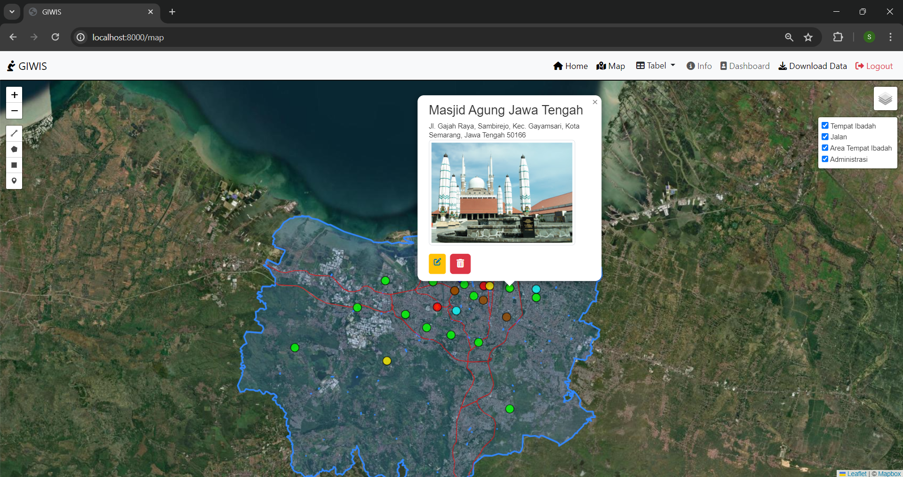
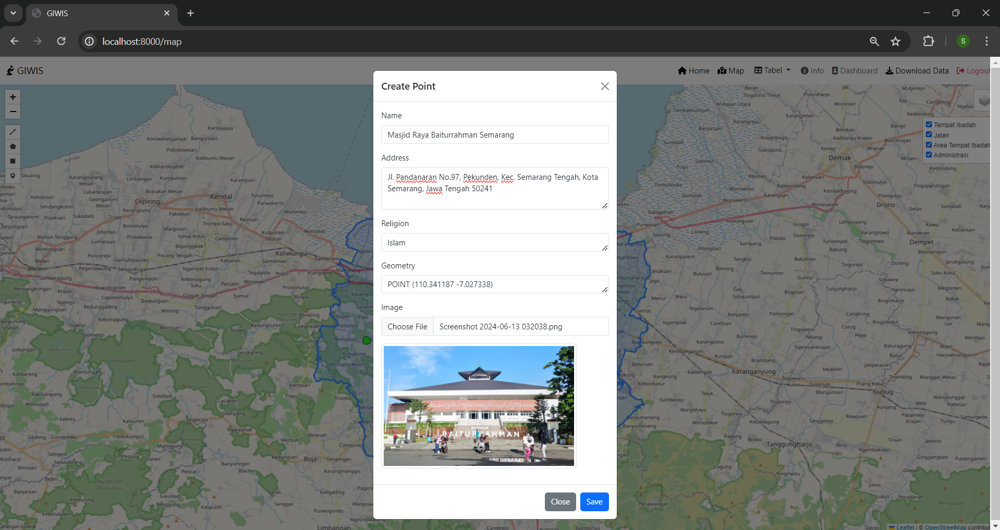
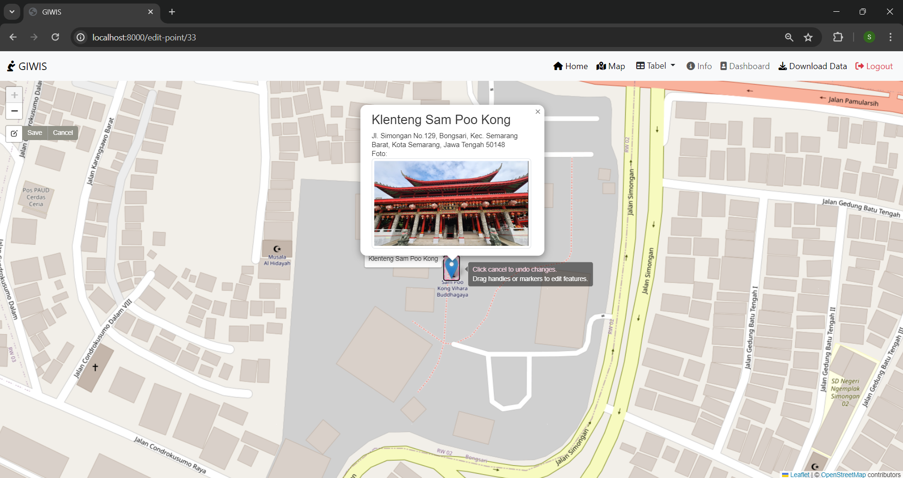

<h1>GIWIS: Geographic Information of Worship in Kota Semarang</h1>

WebGIS interaktif untuk eksplorasi persebaran tempat ibadah agama Islam, Kristen, Katholik, Hindu, Buddha, dan Konghucu di Kota Semarang. WebGIS ini menyediakan beberapa fitur, seperti Map yang menampilkan persebaran titik tempat ibadah masjid, gereja Kristen, gereja Katholik, vihara, klenteng, dan pura. Pengguna dapat menambahkan informasi tempat ibadah dengan Create Point. Fitur Dashboard menyediakan ringkasan dari jumlah tempat ibadah sedangkan fitur Tabel menampilkan informasi atribut dari titik tempat ibadah. Data persebaran tempat ibadah dapat diunduh dalam bentuk CSV menggunakan fitur Download Data.

<h3> Komponen pembangun project </h3>
<ol>
  <li>HTML : Sebagai kerangka dasar dalam pembuatan stuktur dan isi konten WebGIS</li>
  <li>CSS : Mengatur tata letak dan tampilan dari WebGIS</li>
  <li>PHP : Membuat WebGIS lebih dinamis dan interaktif serta dapat berinteraksi dengan database</li>
  <li>Leaflet.js : Library untuk menampilkan peta interaktif, mendukung marker, pop up, plugins, dan sebagainya</li>
  <li>Bootstrap : Library untuk mengatur tampilan dari GUI WebGIS</li>
    <li>Font Awesome : Library untuk menambahkan icon</li>
    <li>Terraformer WKT parser : Library untuk mengkonversi format geometri menjadi Well-Know Text (WKT) atau sebaliknya</li>
    <li>JQuery : Library untuk mempermudah pengambilan data spasial dari server tanpa memuat ulang halaman</li> 
    <li>Laravel : Framework PHP untuk pengembangan aplikasi web dengan pola arsitektur MVC yang memisahkan logika aplikasi (Model), tampilan (View), dan alur kontrol (Controller)</li>
    <li>PostgreSQL : Sistem Manajemen Basis Data Relasional yang menyimpan data spasial titik, garis, dan poligon</li>
    <li>PostGIS : Ekstensi PostgreSQL untuk menyimpan data spasial ke dalam basis data</li>
  <li>Geoserver : Server GIS yang digunakan untuk membagikan, menyimpan, dan mengelola data dari database dalam berbagai format</li>
    <li>DBeaver : Remote database yang terhubung dengan PostgreSQL untuk menampilkan tabel database</li> 
    <li>QGIS : Mengakses dan mengelola data spasial dari database PostgreSQL yang memiliki ekstensi PostGIS</li>
</ol>

<h3>Sumber Data:</h3>
<ol>
  <li>Data shapefile titik tempat ibadah dari <a href="http://geoportal.jatengprov.go.id/">Geoportal Jawa Tengah</a></li>
  <li>Data shapefile administrasi Kota Semarang dari <a href="https://tanahair.indonesia.go.id/portal-web/">InaGeoportal</a></li>
  <li>Data koordinat titik tempat ibadah dari <a href="https://www.google.com/maps">Google Maps</a></li>
</ol>

<h3>Tangkapan Layar Komponen Penting</h3>
<ol>
    <li>Home Page</li> 
    <li>Map</li>  
    <li>Create Point</li> 
    <li>Edit Point</li> 
    <li>Download Data</li> 
    <li>Table Point</li> 
    <li>Dashboard</li> 
</ol>
